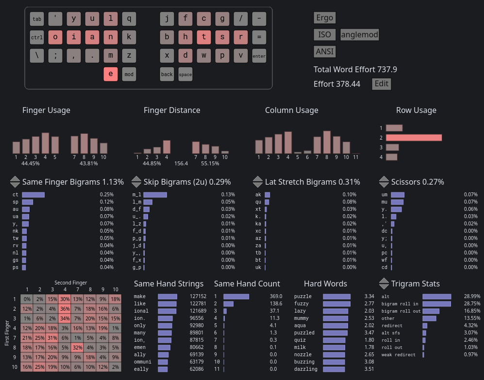
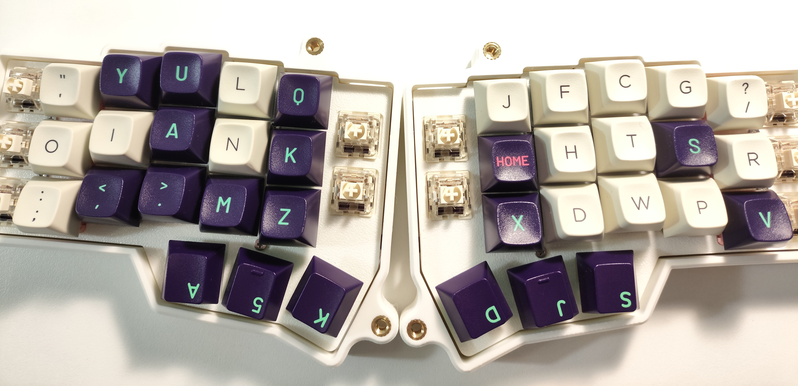
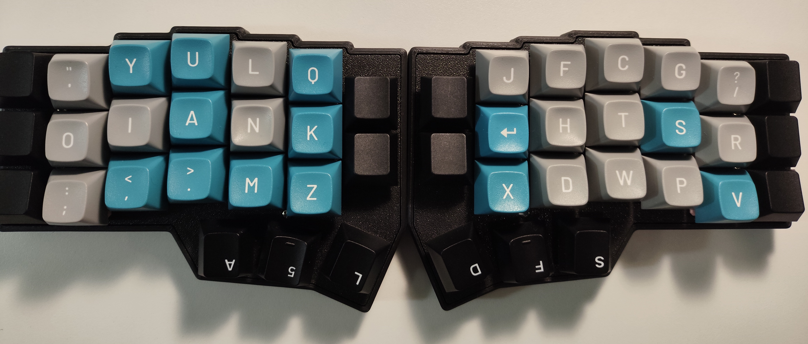
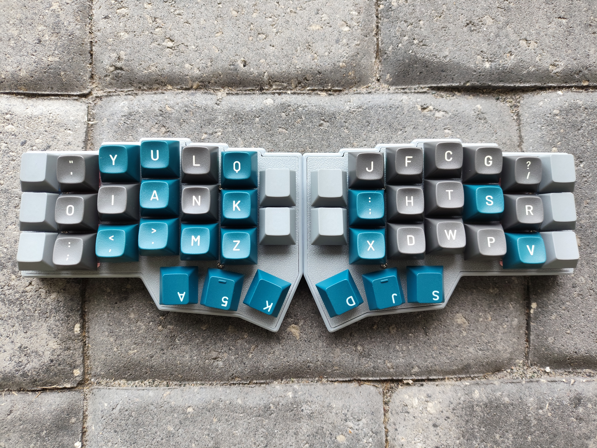

YulianKb
========


An English keyboard layout intended for column-staggered keyboards with dedicated thumb keys.
It is a modified version of [atpmak](https://github.com/Apsu/aptmak) for left-handers coming from dvorak.

```
' y u l q  j f c g ?
o i a n k  b h t s r
; , . m z  x d w p v
      e
```

This layout arranges more frequent top and bottom row consonants onto stronger fingers compared to aptmak.  This is at the expense of higher SFBs, mainly due to the `ct` SFB (0.25%), which I find quite comfortable to type being on a strong finger with a downward raking motion.  The b key is also moved to a closer, more comfortable position, being the most frequent of the inner column letters.



[cyanophage](https://cyanophage.github.io/playground.html?layout=%27yulqjfcg%2F-oiankbhtsr%3D%3B%2C.mzxdwpv%5Ce&mode=ergo&lan=english&thumb=l "cyanophage")

Real YulianKb keyboards:






